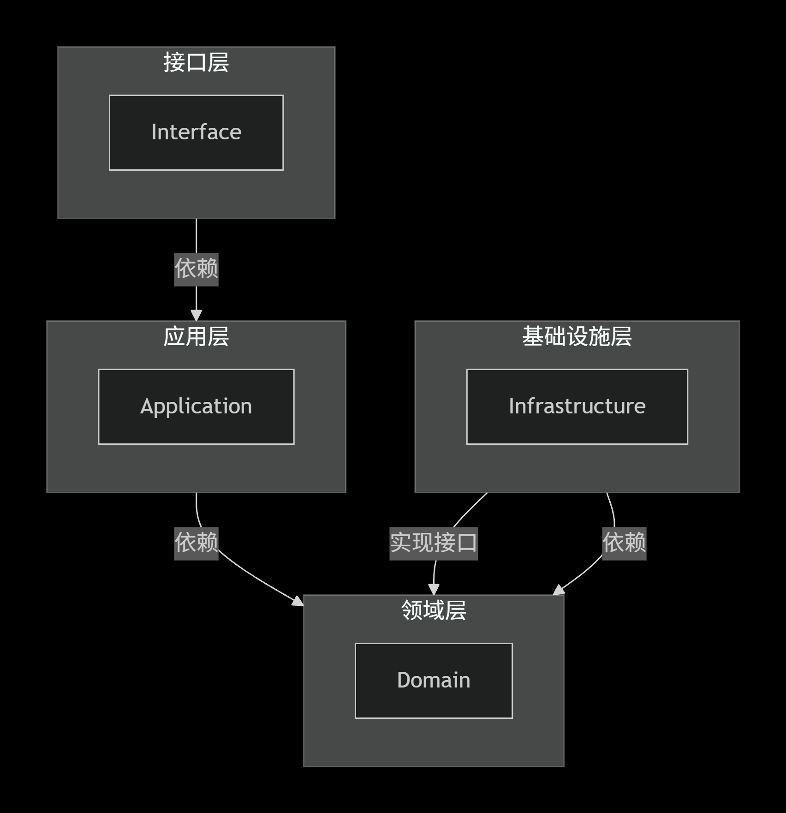

# DDD-Framework
**DDD-Framework**，基于领域驱动设计（DDD）的企业级应用框架，以用户管理为核心领域，展示完整的DDD业务架构实践。AI结合SKILL文档，快速根据表结构创建基础代码（创建、修改、分页查询、根据ID查询）！

## 核心业务场景

- 🎯 **用户生命周期管理**：用户创建、用户修改
- 📧 **消息通知服务**：短信订阅通知功能
- 🔍 **用户信息查询**：支持分页查询、单用户查询、ID精准查询

## 技术架构
采用经典DDD四层架构模式：
- **接口层**：RESTful API接口
- **应用层**：业务流程编排
- **领域层**：核心业务逻辑
- **基础设施层**：技术实现支撑

# AI快速创建新表类文件，搭配ddd-mysql-crud技能
> 💡 .claude/skills/ddd-mysql-crud/SKILL.md
**使用方式：**
```
请根据 ddd-mysql-crud 技能，按下面表结构生成 DDD 各层代码（创建、修改、分页查询、根据 ID 查询）：

create table t_xxx (
id bigint not null auto_increment comment '主键',
...
primary key (id)
) engine = InnoDB default charset = utf8mb4 comment = 'xxx表';
```

# DDD分层职责

| 层次 | 英文名称 | 核心职责                   | 主要组件                                          | 依赖关系 |
|------|---------|------------------------|-----------------------------------------------|----------|
| **接口层** | Interface | 处理外部请求，数据格式转换          | Controller、DTO、Facade                         | 依赖应用层 |
| **应用层** | Application | 协调领域对象完成业务用例，流程编排，事务控制 | ApplicationService、Command、Query              | 依赖领域层 |
| **领域层** | Domain | 实现核心业务逻辑和业务规则          | Entity、ValueObject、DomainService、Repository接口 | 不依赖其他层 |
| **基础设施层** | Infrastructure | 提供技术支撑和外部系统交互          | RepositoryImpl、Config、MQ、Cache、外部服务调用         | 依赖领域层 |

## 依赖关系图

```graph
graph TD
    subgraph Interface[接口层]
        A1[Interface]
    end

    subgraph Application[应用层]
        B1[Application]
    end

    subgraph Domain[领域层]
        C1[Domain]
    end

    subgraph Infrastructure[基础设施层]
        D1[Infrastructure]
    end

    Interface -->|依赖| Application
    Application -->|依赖| Domain
    Infrastructure -->|实现接口| Domain
    Infrastructure -->|依赖| Domain
```

# 项目结构
```text
DDD-Framework/
├── pom.xml                                   (父POM，管理依赖和模块)
│
├── user-sdk/                                (开放平台SDK接口，支持外部服务Feign调用RPC接口)    
│   ├── pom.xml
│   └── src/main/java/com/ddd/sdk/user/
│       ├── api/
│       │   └── UserOpenApi.java             (对外SDK接口)
│       └── entity/
│           ├── request/
│           │   └── UserRequest.java         (SDK请求对象)
│           └── response/
│               └── UserResponse.java        (SDK响应对象)
│
├── user-interface/                             (接口层)    
│   ├── pom.xml
│   └── src/main/java/com/ddd/interfaces/
│       └── controller/
│           ├── user/
│           │   └── UserController.java      (用户REST接口)
│           └── open/
│               └── UserOpenController.java  (对外开放接口)
│
├── user-application/                        (应用层)    
│   ├── pom.xml
│   └── src/main/java/com/ddd/application/user/
│       ├── UserApplicationService.java      (用户应用服务接口)
│       └── impl/
│           └── UserApplicationServiceImpl.java (用户应用服务实现)
│
├── user-domain/                             (领域层)    
│   ├── pom.xml
│   └── src/main/java/com/ddd/domain/user/
│       ├── README.md
│       ├── aggregate/
│       │   └── UserAggregate.java           (用户聚合根，含业务校验)
│       ├── cache/
│       │   └── UserCache.java               (用户缓存接口)
│       ├── entity/
│       │   ├── command/
│       │   │   ├── UserCreateCommand.java   (用户创建命令)
│       │   │   ├── UserUpdateCommand.java   (用户更新命令)
│       │   │   └── SubscribeSMSNotifyCommand.java (订阅短信通知命令)
│       │   ├── dto/
│       │   │   ├── UserCreateDTO.java       (用户创建数据传输对象)
│       │   │   └── UserDTO.java             (用户数据传输对象)
│       │   ├── model/
│       │   │   └── UserModel.java           (用户领域模型)
│       │   └── query/
│       │       ├── UserPageQuery.java       (用户分页查询条件)
│       │       └── UserQuery.java           (用户查询条件)
│       ├── event/
│       │   ├── SpringDomainEventPublisher.java (领域事件发布器)
│       │   └── UserCreatedEvent.java        (用户创建领域事件)
│       ├── repository/
│       │   └── UserRepository.java          (用户仓储接口)
│       └── service/
│           ├── UserDomainService.java       (用户领域服务接口)
│           └── impl/
│               └── UserDomainServiceImpl.java (用户领域服务实现)
│
├── user-infrastructure/                       (基础设施层)
│   ├── pom.xml
│   └── src/main/java/com/ddd/infrastructure/user/
│       ├── cache/
│       │   └── UserCacheImpl.java           (用户缓存实现)
│       ├── entity/
│       │   └── UserDO.java                  (用户数据对象)
│       ├── listener/
│       │   ├── UserCreatedEventListener.java (用户创建事件监听器)
│       ├── mapper/
│       │   └── UserMapper.java              (MyBatis Mapper接口)
│       └── repository/
│           └── UserRepositoryImpl.java      (用户仓储实现)
│
├── user-base/                                (基础项目，存放全局基础类、枚举、异常类)
│   ├── pom.xml
│   └── src/main/java/com/ddd/sdk/
│       ├── entity/
│       │   ├── PageBase.java                 (分页基础类)
│       │   └── ResponseBase.java             (统一响应基础类)
│       ├── enums/
│       │   └── ErrorCodeEnum.java            (错误码枚举)
│       └── exception/
│           └── BusinessException.java        (业务异常)
│
├── user-common/                              (公共项目，处理公共配置、处理器、工具类)
│   ├── pom.xml
│   └── src/main/java/com/ddd/common/
│       ├── configuration/
│       │   └── SwaggerConfiguration.java    (Swagger多分组配置)
│       │   └── GlobalExceptionHandler.java  (全局异常处理器)
│       └── util/
│           ├── BeanUtil.java                (Bean转换工具)
│           └── ObjectUtil.java              (对象工具类)
│
└── user-bootstrap/                          (启动项目)    
├── pom.xml
├── src/main/java/com/ddd/bootstrap/user/
│   └── UserBootstrap.java               (Spring Boot启动类)
└── src/main/resources/
├── application.yml                   (应用配置文件)
└── META-INF/
└── app.properties               (应用元信息)
```

# 用户创建时序图
- 【interfaces】Start 用户创建请求 Interfaces
- 【application】用户创建请求 Application
- 【domain】基础校验：聚合根内完成用户名格式，可采用ValueObject简化
- 【domain】创建聚合根 userAggregate
- 【domain】业务校验 UserAggregate
- 【domain】详细业务逻辑处理 UserAggregate
- 【infrastructure】持久化 UserAggregate.userModel
- 【infrastructure】缓存 UserAggregate.userModel
- 【domain】初始化发送事件 UserCreatedEvent
- 【infrastructure】事件消费 UserCreatedEvent
- 【infrastructure】MQ send user.created.success
- 【application】End 用户创建成功


```sequenceDiagram
sequenceDiagram
    participant Controller as interfaces.user.controller.UserController
    participant Application as application.user.impl.UserApplicationServiceImpl
    participant DomainAggregate as domain.user.aggregate.UserAggregate
    participant DomainService as domain.user.service.impl.UserDomainServiceImpl
    participant InfraRepo as infrastructure.user.repository.UserRepositoryImpl
    participant InfraCache as infrastructure.user.cache.UserCacheServiceServiceImpl
    participant DomainEvent as domain.user.event.UserCreatedEvent
    participant Listener as infrastructure.user.listener.UserCreatedEventListener
    participant MQ as Message Queue

    Controller->>Application: create()
    Note over Controller: 1、Start 用户创建请求 Interfaces

    Application->>Application: create()
    Note over Application: 2、用户创建请求 Application

    Application->>DomainAggregate: validateUsernameFormat()
    Note over DomainAggregate: 3、基础校验：聚合根内完成用户名格式，可采用ValueObject简化

    Application->>DomainAggregate: create()
    Note over DomainAggregate: 4、创建聚合根 userAggregate

    Application->>DomainService: businessValidation(UserAggregate)
    Note over DomainService: 5、业务校验 UserAggregate

    Application->>DomainService: logicProcess(UserAggregate)
    Note over DomainService: 6、详细业务逻辑处理 UserAggregate

    Application->>InfraRepo: create(userModel)
    Note over InfraRepo: 7、持久化 UserAggregate.userModel

    Application->>InfraCache: saveCache(userModel)
    Note over InfraCache: 8、缓存 UserAggregate.userModel

    Application->>DomainEvent: new UserCreatedEvent(userId)
    Note over DomainEvent: 9、初始化发送事件 UserCreatedEvent userId: 1

    DomainEvent-->>Listener: 事件发布
    Listener->>Listener: handleUserCreated()
    Note over Listener: 10、事件消费 UserCreatedEvent userId: 1

    Listener->>MQ: send()
    Note over Listener: 11、MQ send user.created.success

    Application-->>Controller: return userId
    Note over Application: 12、End 用户创建成功 userId: 1
```

